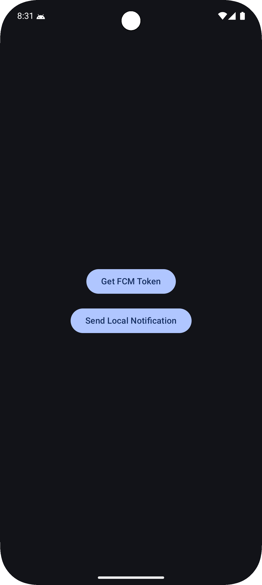
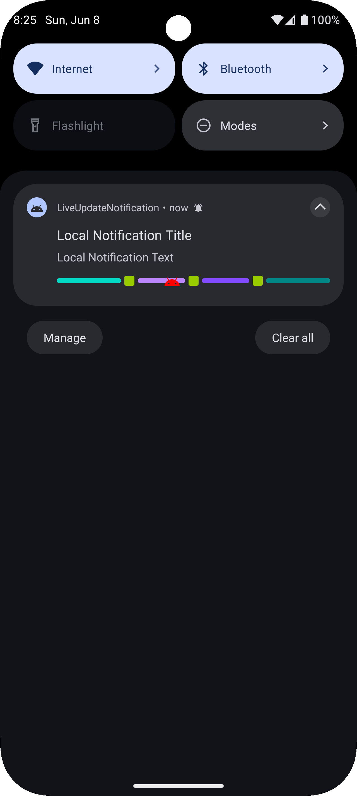
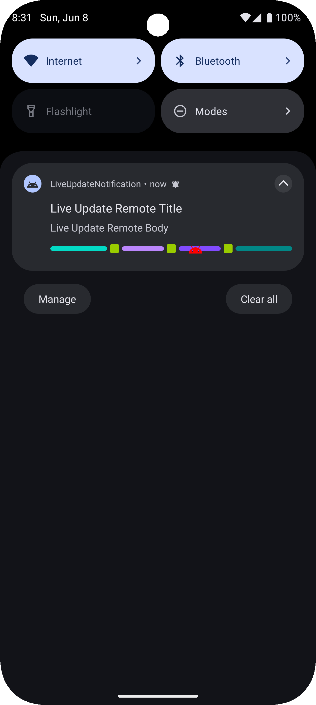

# Live Update Notification Android

[](https://linktr.ee/nicos_nicolaou)
[](https://nicosnicolaou16.github.io/)
[](https://twitter.com/nicolaou_nicos)
[](https://linkedin.com/in/nicos-nicolaou-a16720aa)
[](https://medium.com/@nicosnicolaou)
[](https://androiddev.social/@nicolaou_nicos)
[](https://bsky.app/profile/nicolaounicos.bsky.social)
[](https://dev.to/nicosnicolaou16)
[](https://www.youtube.com/@nicosnicolaou16)
[](https://g.dev/nicolaou_nicos)

This repository provides a working example of implementing Live Update Notifications on Android 16 (
Android U). It demonstrates how to leverage both Firebase Cloud Messaging (FCM) and local
notifications to deliver rich, timely updates to the user.

# Examples

<p align="left">
  <a title="simulator_image"></a>
  <a title="simulator_image"></a>
  <a title="simulator_image"></a>
  <a title="simulator_image"></a>
</p>

# 🚀 Features

- 🔔 Live Notifications support on Android 16
- ☁️ Firebase Cloud Messaging integration
- 📦 Payload handling and dynamic content updates
- 📱 Local notification example to simulate live updates without a backend
- 💡 Best practices for targeting Android 16+ notification behavior

# 📦 What’s Inside

- Sample app written in Kotlin
- Firebase integration (with sample payload format)
- Notification channel setup and management
- Code examples to create/update live notifications

# 🔧 Requirements

- Target SDK 36 (Android 16)
- Firebase project (for push notifications)

# 📚 Getting Started

### 1️⃣ Clone the Repository <br />

### 2️⃣ Set Up Firebase

- Go to Firebase Console and create a new project (or use an existing one).
- Add an Android app to the Firebase project using your app’s package name.
    - 💡 Tip: You can change the application ID (package name) in build.gradle to match your
      preferred namespace (e.g., com.yourname.app).
- Download the google-services.json file and place it in the /app directory.
- Enable Firebase Cloud Messaging (FCM) in the Firebase Console under Build > Cloud Messaging.
- Launch the app and tap the "Get FCM Token" button:
    - The token will be shown in a toast and logged in Logcat
    - Copy this token for sending test messages

### 3️⃣ Run the App

- Connect a physical device or use an emulator running Android 16
- Press Run in Android Studio to build and install the app

### 4️⃣ Test Live Notifications <br />

🔹 Option A: Test with Local Notification

- Tap the "Send Local Notification" button in the app
- It creates a live progress notification based on a local NotificationModel instance

🔹 Option B: Test with Firebase Console

- Go to Firebase Console > Cloud Messaging > Send Your First Message
- Enter a title and body (these will be overridden by data payload)
- Open Advanced options → Data
- In the Target section, select Single Device
- Paste the FCM token from the app
- Add the following key-value pairs:

### 📝 Example FCM Payload

```json
{
  "title": "Live Update Remote Title",
  "body": "Live Update Remote Body",
  "currentProgress": "80",
  "currentProgressSegmentOne": "33",
  "currentProgressSegmentTwo": "33",
  "currentProgressSegmentThree": "33",
  "currentProgressSegmentFour": "33",
  "currentProgressPointOne": "33",
  "currentProgressPointTwo": "66",
  "currentProgressPointThree": "99"
}

```

- Click Send Message

  📌 The payload demonstrates segmented and point-based progress tracking in a live notification,
  perfect for use cases like order tracking, fitness goals, or download status.

# Firebase Cloud Messaging (Example)

<p align="left">
  <a title="simulator_image"></a>
</p>

> [!IMPORTANT]  
> Check my article for the setup :point_right: [Implementing Live Update Notifications in Android 16 - Medium](https://medium.com/@nicosnicolaou/implementing-live-update-notifications-in-android-16-7c962ec6c373) :point_left: <br />

# 🔧 Versioning

Target SDK version: 37 <br />
Minimum SDK version: 29 <br />
Kotlin version: 2.4.10 <br />
Gradle version: 9.3.1 <br />

# 📚 References

-   [Android 16: Progress-centric notifications](https://developer.android.com/about/versions/16/features/progress-centric-notifications)
-   [Official Sample: Live Updates on GitHub](https://github.com/android/platform-samples/tree/main/samples/user-interface/live-updates)
-   [Documentation: Update a notification](https://developer.android.com/develop/ui/views/notifications/build-notification#Updating)

## ⭐ Stargazers

If you enjoy this project, please give it a star!
Check out all the stargazers
here: [Stargazers on GitHub](https://github.com/NicosNicolaou16/Live_Update_Notifcation_Android/stargazers)

## 🙏 Support & Contributions

This project is actively maintained. Feedback, bug reports, and feature requests are welcome! Please feel free to **open an issue** or submit a **pull request**.